# Practicing SQL queries

## Questions to solve

### Question 1
- Make a query for take the register in the data base with the following pattern "Canton_name , Provincia_name :ha --> hectares". 
### Solution:
```
SELECT concat(NCANTON,", ",NPROVINCIA,":Ha -->",HECTARES as "CPH" FROM "Cantones2014ctm05";
```
### Result:
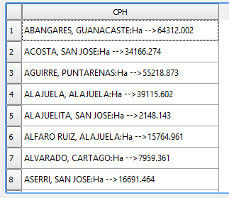

### Question 2
- Create a query to get the name of the "cantones" whose name begins with the letter 'B'
### Solution:
```
SELECT NCANTON as "Canton" FROM "Cantones2014ctm05" WHERE "NCANTON" LIKE 'B%';
```
### Result:
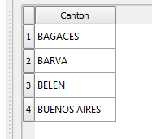

### Question 3
- Generate a query for get the population density (2010, 2011) for each "canton".
### Solution:
```
SELECT NCANTON as 'canton', ((POB_2000_H + POB_2000_M)/HECTARES)*100 AS 'DENS2010', ((POB_2011_H + POB_2011_M)/HECTARES)*100 AS 'DENS2011' FROM "Cantones2014ctm05";
```
### Result:
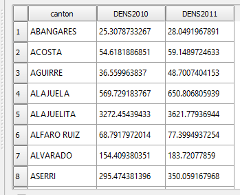

### Question 4
- Create a query for get the population density in 2011 by "Provincia".
### Solution:
```
SELECT "NPROVINCIA" as "Provincia", ((sum("POB_2011_H") + sum("POB_2011_M"))/(sum("HECTARES"))*100) AS 'DENS2011' FROM "Cantones2014ctm05" group by "NPROVINCIA";
```
### Result:
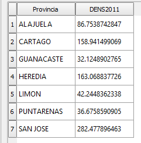

### Question 5
- Get the "provincia" name, "canton" name and hectares of each "canton" where the "canton" name begins with the letter 'B' and the hectares are more than twenty thousand.
### Solution:
```
SELECT NPROVINCIA as "provincia", NCANTON as "canton", HECTARES as "ha" FROM 'Cantones2014ctm05' WHERE HECTARES > 20.0000 AND NCANTON LIKE 'A%';
```
### Result:
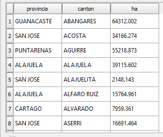

### Question 6
- Get "provincia" name and "canton" name only for the "cantones" whose name begins with the letter 'A'.
### Solution:
```
SELECT NPROVINCIA AS 'Provincia', NCANTON AS 'Canton' FROM "Cantones2014ctm05" WHERE "NCANTON" LIKE 'A%';
```
### Result:
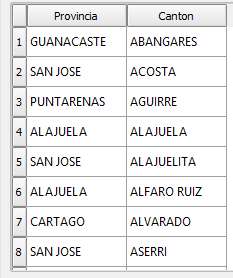

### Question 7
- By the total area in square kilometers, liste from highest to lowest the "provincia" name and the respective total of square kilometers. 
### Solution:
```
SELECT "NPROVINCIA" AS "Provincia",  sum("HECTARES") as "Km2" FROM "Cantones2014ctm05" group by "NPROVINCIA";
```
### Result:
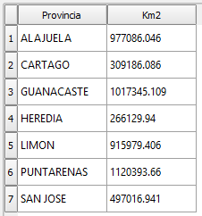

### Question 8
- Get the "cantones" name on where the name is not more thant 10 characters.
### Solution:
```
SELECT NCANTON FROM "Cantones2014ctm05" WHERE LEN(NCANTON) >= 10;
```

### Question 9
9- Obtain the "provincias" with their total number of "cantones".
### Solution:
```
SELECT count("NCANTON") as "NumCantones", "NPROVINCIA" as "Provincia" FROM "Cantones2014ctm05" group by "NPROVINCIA";
```
### Result:
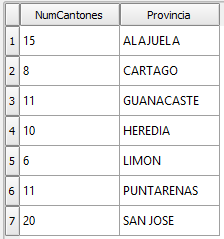

### Question 10
- Create a query for get the "provincia" with their population in 2011.
### Solution:
```
SELECT sum("POB_2011_H") + sum("POB_2011_M") AS "Pob2011", "NPROVINCIA" as "Provincia" FROM "Cantones2014ctm05" group by "NPROVINCIA";
```
### Result:
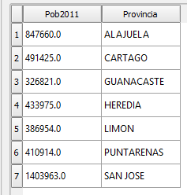

### Question 11
- Generate a query for get the total of men, total of woman, total population, area in square kilometers and population density by "provincia".
### Solution:
```
SELECT "NPROVINCIA" AS "Provincia", sum("POB_2011_H") as "PobHombres",sum("POB_2011_M") as "PobMujeres", sum("POB_2011_H") + sum("POB_2011_M") AS "PobTotal",  sum("HECTARES") as "Km2", ((sum("POB_2011_H") + sum("POB_2011_M"))/(sum("HECTARES"))*100)  as "DensPob" FROM "Cantones2014ctm05" group by "NPROVINCIA";
```
### Result:
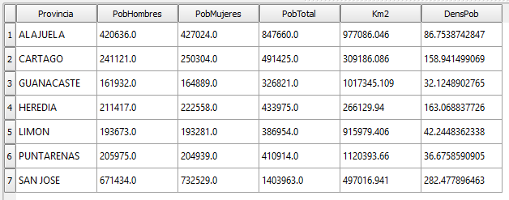

### Question 12
- Shows the "canton" name and the "provincia" name for those cases when their "cantones" name contains the letter R and S.
### Solution:
```
SELECT concat(NCANTON,'-->',NPROVINCIA) as 'CantonProvincia' FROM "Cantones2014ctm05" WHERE "NCANTON" LIKE '%R%' AND "NCANTON" LIKE '%S%';
```
### Result:
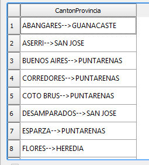